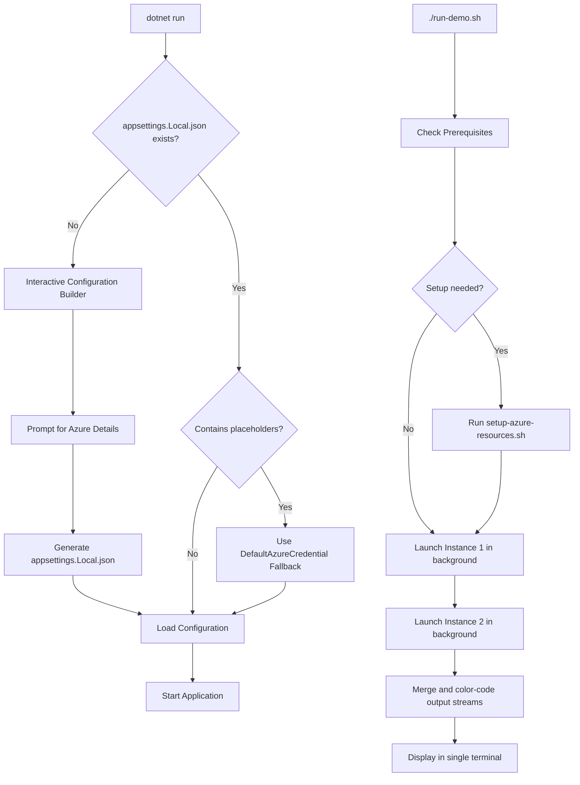
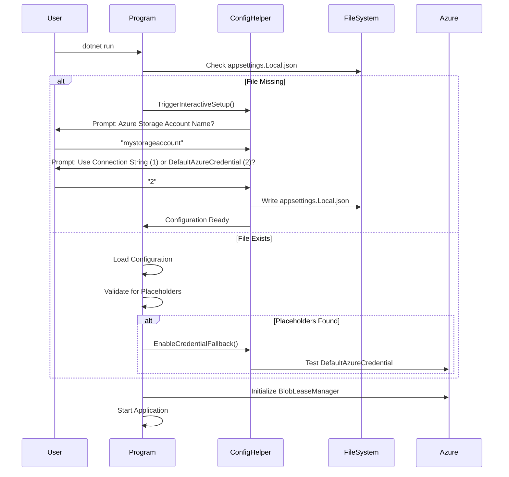
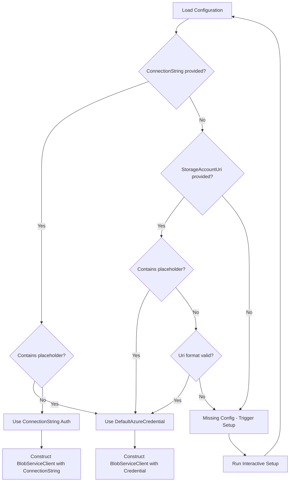

# Enhanced Configuration Handling and Multi-Instance Runner for BlobLeaseSample

## Overview

Enhance the BlobLeaseSample to automatically handle missing or invalid configuration files and provide a streamlined multi-instance execution experience. This eliminates manual setup friction and simplifies the demo workflow by:

1. Automatically detecting missing `appsettings.Local.json` and prompting for interactive configuration
2. Gracefully falling back to DefaultAzureCredential when connection strings contain placeholders
3. Providing a combined script that runs setup and launches both instances together in one terminal
4. Enabling color-coded output to distinguish between instances

## Problem Statement

### Current User Experience Issues

1. **Configuration Error on First Run**
   - Users encounter `System.InvalidOperationException` when running `dotnet run` without setup
   - Error message references placeholder URI `https://[YOUR_STORAGE_ACCOUNT].blob.core.windows.net`
   - Requires manual execution of setup script before any demo can run

2. **Multi-Terminal Complexity**
   - Demonstrating lock competition requires opening 2-3 separate terminal windows
   - Users must manually execute commands in each terminal
   - Difficult to observe concurrent behavior and timing
   - Output scattered across multiple windows reduces clarity

3. **Manual Setup Workflow**
   - Setup script and application execution are separate steps
   - No validation that setup completed successfully before running demo
   - Users can accidentally skip setup step

## Root Cause Analysis

### Configuration Binding Failure

The .NET configuration binder attempts strict type conversion during service registration, causing immediate failure when encountering placeholder values. The configuration loading order is:

1. appsettings.json (contains template placeholders like `[YOUR_STORAGE_ACCOUNT]`)
2. appsettings.{Environment}.json (optional environment overrides)
3. appsettings.Local.json (git-ignored file with actual Azure credentials)

When `appsettings.Local.json` is missing:
- Configuration binder receives placeholder string value
- Attempts to parse as System.Uri during `BlobLeaseProviderOptions` binding
- UriFormatException thrown before application logic can detect the issue

### Multi-Terminal Friction

The existing `run-competition-demo.sh` is an interactive guide that displays commands but does not execute them:
- Provides instructions for manual terminal setup
- Requires users to copy/paste commands into separate terminals
- Lacks automated orchestration of multiple instances

## Objectives

### Primary Goals

1. **Self-Healing Configuration**
   - Enable `dotnet run` to succeed on first execution without manual setup
   - Auto-generate `appsettings.Local.json` through interactive prompts when missing
   - Detect placeholder values and fall back to DefaultAzureCredential authentication
   - Validate configuration before attempting Azure operations

2. **Simplified Multi-Instance Execution**
   - Provide single-command demo execution: `./run-demo.sh`
   - Combine setup and dual-instance launch into one script
   - Display both instances' output in one terminal with color-coded distinction
   - Eliminate need for multiple terminal windows

3. **Interactive Setup Experience**
   - Prompt users for Azure configuration values when missing
   - Provide sensible defaults where possible
   - Persist generated configuration to `appsettings.Local.json`
   - Support both connection string and DefaultAzureCredential authentication modes

## Proposed Solution Architecture

### Solution Components



### Configuration Resolution Strategy

The application will attempt configuration resolution in this priority order:

1. **Check for appsettings.Local.json**
   - If missing: trigger interactive configuration wizard
   - If present: proceed to validation

2. **Validate Configuration Values**
   - Detect placeholder patterns (e.g., `[YOUR_STORAGE_ACCOUNT]`)
   - If placeholders found: enable DefaultAzureCredential fallback mode

3. **Authentication Mode Selection**
   - Connection String mode: Direct connection using provided credentials
   - DefaultAzureCredential mode: Uses Azure CLI/Managed Identity authentication

4. **Prompt for Missing Values**
   - Storage account name
   - Container name (default: "leases")
   - Authentication preference (connection string vs. credential-based)

## Proposed Changes

### 1. Application Startup Logic Enhancement

**Component**: Program.cs Main method

**Changes Required**:

**A. Configuration Validation on Startup**
- Add configuration validation before service registration
- Detect missing `appsettings.Local.json` file
- Detect placeholder patterns in configuration values
- Display user-friendly guidance when issues detected

**B. Interactive Configuration Builder**
- Create new `ConfigurationHelper` class to encapsulate setup logic
- Prompt user for required Azure configuration values
- Support two authentication modes:
  - Mode 1: Connection String (simple, local development)
  - Mode 2: DefaultAzureCredential (recommended, production-ready)
- Generate and persist `appsettings.Local.json` with user input
- Validate generated configuration before proceeding

**C. Placeholder Detection Logic**
- Check `StorageAccountUri` for bracket notation: `[YOUR_STORAGE_ACCOUNT]`
- Check `ConnectionString` for placeholder patterns
- When detected, log informational message and enable credential fallback

**D. Graceful Fallback Mechanism**
- When placeholders detected: construct StorageAccountUri from user-provided account name
- Use `BlobServiceClient(Uri, DefaultAzureCredential)` constructor
- Validate Azure CLI authentication status before proceeding
- Provide clear error message if authentication unavailable

**Implementation Flow**:



**Rationale**: Eliminates manual setup barrier and provides guided experience for first-time users while maintaining flexibility for advanced scenarios.

### 2. ConfigurationHelper Utility Class

**Component**: New file - ConfigurationHelper.cs

**Responsibilities**:

**A. File Existence Validation**
- Method: `CheckLocalConfigurationExists() -> bool`
- Returns true if `appsettings.Local.json` exists
- Returns false and triggers interactive setup if missing

**B. Placeholder Detection**
- Method: `ContainsPlaceholders(BlobLeaseProviderOptions) -> bool`
- Checks for bracket notation patterns: `[...]`
- Checks for common placeholder keywords: "YOUR", "REPLACE", "EXAMPLE"
- Returns true if any placeholder detected

**C. Interactive Configuration Wizard**
- Method: `RunInteractiveSetup() -> ConfigurationResult`
- Step 1: Welcome message explaining setup process
- Step 2: Prompt for Azure Storage Account Name (validate format: lowercase, alphanumeric)
- Step 3: Prompt for Container Name (default: "leases")
- Step 4: Prompt for Authentication Mode selection
- Step 5: If mode 1 selected, prompt for connection string
- Step 6: Generate JSON content
- Step 7: Write to `appsettings.Local.json`
- Step 8: Confirm success to user

**D. Azure CLI Validation**
- Method: `ValidateAzureCliAuthentication() -> ValidationResult`
- Execute: `az account show` to check login status
- Parse output to verify active subscription
- Return success/failure with user-friendly message

**E. Configuration File Generation**
- Method: `GenerateLocalConfiguration(ConfigurationInput) -> void`
- Build JSON structure based on authentication mode
- For DefaultAzureCredential mode:
  ```
  {
    "BlobLeasing": {
      "StorageAccountUri": "https://{accountName}.blob.core.windows.net",
      "ConnectionString": null
    }
  }
  ```
- For Connection String mode:
  ```
  {
    "BlobLeasing": {
      "StorageAccountUri": null,
      "ConnectionString": "{userProvidedConnectionString}"
    }
  }
  ```
- Write with proper formatting (indented JSON)
- Set file permissions appropriately

**User Interaction Design**:

```
═══════════════════════════════════════════════════════════════
  AZURE BLOB LEASE SAMPLE - FIRST-TIME SETUP
═══════════════════════════════════════════════════════════════

Configuration file not found. Let's set up your Azure connection.

1. What is your Azure Storage Account name?
   (Format: lowercase letters and numbers only)
   Example: mystorageaccount123
   
   Account Name: █

2. What container name should be used for leases?
   Default: leases
   
   Container Name [leases]: █

3. How would you like to authenticate?
   1) Connection String (simple - for local development)
   2) DefaultAzureCredential (recommended - uses Azure CLI login)
   
   Choice (1 or 2): █

[If option 1 selected]
4. Enter your Azure Storage connection string:
   (Find in Azure Portal > Storage Account > Access Keys)
   
   Connection String: █

[If option 2 selected]
✓ Checking Azure CLI authentication...
✓ Authenticated as: user@example.com
✓ Subscription: Visual Studio Enterprise Subscription

━━━━━━━━━━━━━━━━━━━━━━━━━━━━━━━━━━━━━━━━━━━━━━━━━━━━━━━━━━━

✓ Configuration saved to: appsettings.Local.json
✓ Starting application...

═══════════════════════════════════════════════════════════════
```

**Rationale**: Provides guided, user-friendly setup experience without requiring separate script execution.

### 3. Enhanced Run Demo Script

**Component**: New file - run-demo.sh (replaces run-competition-demo.sh)

**Purpose**: Single-command execution of complete demo including setup and dual instances

**Script Workflow**:

**A. Prerequisites Validation**
- Check .NET SDK installation and version
- Check Azure CLI installation (warn if missing but not required)
- Check current directory is BlobLeaseSample

**B. Setup Integration**
- Check if `appsettings.Local.json` exists
- If missing: prompt user "Run Azure setup now? (y/n)"
- If yes: execute `./setup-azure-resources.sh`
- If no: exit with message to run setup manually or use interactive mode in app
- Validate setup completed successfully

**C. Dual Instance Launch**
- Define instance configurations:
  - Instance 1: `--instance us-east-1 --region us-east`
  - Instance 2: `--instance eu-west-1 --region eu-west`
- Launch Instance 1 in background process, pipe output to temp file with prefix tag
- Sleep 2 seconds (allow Instance 1 to acquire lock first)
- Launch Instance 2 in background process, pipe output to temp file with prefix tag
- Capture both process IDs

**D. Output Merging and Coloring**
- Tail both output files simultaneously
- Apply color coding:
  - Instance 1 (us-east-1): Green text
  - Instance 2 (eu-west-1): Cyan text
- Prefix each line with instance identifier: `[us-east-1]` or `[eu-west-1]`
- Merge output streams chronologically
- Display in single terminal view

**E. Cleanup and Signal Handling**
- Register trap for SIGINT (Ctrl+C)
- On interrupt:
  - Send SIGTERM to both instance processes
  - Wait for graceful shutdown
  - Clean up temporary output files
  - Display summary

**Script Structure**:

```bash
#!/bin/bash

# Color definitions
GREEN='\033[0;32m'
CYAN='\033[0;36m'
YELLOW='\033[1;33m'
RED='\033[0;31m'
NC='\033[0m'

# Temp files for instance outputs
INSTANCE1_LOG="/tmp/blob-lease-demo-instance1.log"
INSTANCE2_LOG="/tmp/blob-lease-demo-instance2.log"

# Cleanup function
cleanup() {
    echo "Stopping instances..."
    kill $INSTANCE1_PID $INSTANCE2_PID 2>/dev/null
    wait $INSTANCE1_PID $INSTANCE2_PID 2>/dev/null
    rm -f $INSTANCE1_LOG $INSTANCE2_LOG
    exit 0
}

trap cleanup SIGINT SIGTERM

# Prerequisites check
# Setup validation
# Launch instances
# Merge output streams
# Wait for completion or interrupt
```

**Output Example**:

```
═══════════════════════════════════════════════════════════════
  DISTRIBUTED LOCK DEMO - DUAL INSTANCE MODE
═══════════════════════════════════════════════════════════════

✓ Prerequisites validated
✓ Configuration found: appsettings.Local.json
✓ Launching instances...

━━━━━━━━━━━━━━━━━━━━━━━━━━━━━━━━━━━━━━━━━━━━━━━━━━━━━━━━━━━

[us-east-1] ════════════════════════════════════════════════
[us-east-1] DISTRIBUTED LOCK DEMO
[us-east-1] Instance ID: us-east-1
[us-east-1] Region: us-east
[us-east-1] ════════════════════════════════════════════════

[eu-west-1] ════════════════════════════════════════════════
[eu-west-1] DISTRIBUTED LOCK DEMO
[eu-west-1] Instance ID: eu-west-1
[eu-west-1] Region: eu-west
[eu-west-1] ════════════════════════════════════════════════

[us-east-1] ✓ LOCK ACQUIRED SUCCESSFULLY
[us-east-1] Lease ID: 954d91dc-67fd-409a-b78a...

[eu-west-1] ✗ LOCK ACQUISITION FAILED
[eu-west-1] Current holder: us-east-1 (us-east region)
[eu-west-1] Exiting gracefully...

[us-east-1] Processing work item #1 | Elapsed: 00:03
[us-east-1] Processing work item #2 | Elapsed: 00:06

━━━━━━━━━━━━━━━━━━━━━━━━━━━━━━━━━━━━━━━━━━━━━━━━━━━━━━━━━━━
Press Ctrl+C to stop demo
```

**Rationale**: Eliminates multi-terminal complexity, provides streamlined demo experience, and clearly distinguishes instance output.

### 4. BlobLeaseProviderOptions Configuration Binding Update

**Component**: BlobLeaseManagerExtensions.cs service registration

**Changes Required**:

**A. Delayed Configuration Binding**
- Move configuration binding from service registration to factory resolution
- Perform validation after options instance created
- Enable placeholder detection before Azure client creation

**B. Conditional Client Construction**
- Check if `ConnectionString` is null or contains placeholders
- Check if `StorageAccountUri` is null or contains placeholders
- Branch to appropriate authentication mode:
  - Connection String path: `new BlobServiceClient(connectionString)`
  - Credential path: `new BlobServiceClient(storageUri, new DefaultAzureCredential())`

**Current Implementation** (line 52 in BlobLeaseManagerExtensions.cs):
```
services.AddBlobLeaseManager(options =>
{
    blobLeasingConfig.Bind(options);  // Fails immediately if URI invalid
    ...
});
```

**Proposed Implementation**:
```
services.AddBlobLeaseManager(options =>
{
    // Manual property binding with validation
    var storageAccountUri = blobLeasingConfig["StorageAccountUri"];
    var connectionString = blobLeasingConfig["ConnectionString"];
    
    // Detect placeholders
    if (ConfigurationHelper.IsPlaceholder(storageAccountUri))
    {
        // Fall back to DefaultAzureCredential mode
        options.StorageAccountUri = null;
        options.ConnectionString = null;
        // Set flag to use credential-based construction later
    }
    else if (!string.IsNullOrEmpty(connectionString))
    {
        options.ConnectionString = connectionString;
    }
    else if (!string.IsNullOrEmpty(storageAccountUri))
    {
        options.StorageAccountUri = new Uri(storageAccountUri);
    }
    
    // Bind remaining properties safely
    options.ContainerName = blobLeasingConfig["ContainerName"];
    options.DefaultLeaseDuration = ...
    ...
});
```

**Rationale**: Prevents configuration binding exception and enables graceful handling of placeholder values.

### 5. README.md Documentation Updates

**Location**: samples/BlobLeaseSample/README.md

**Changes Required**:

**A. Update Quick Start Section (lines 13-40)**

Revised flow:
```markdown
## Quick Start

### Option 1: Automatic Setup (Recommended)

Run the combined demo script that handles setup and execution:

```bash
cd samples/BlobLeaseSample
./run-demo.sh
```

This script will:
- Validate prerequisites (.NET SDK, Azure CLI)
- Run Azure resource setup if needed
- Launch two competing instances automatically
- Display color-coded output in one terminal

### Option 2: Manual Setup and Execution

```bash
# Step 1: Setup Azure resources (one-time)
./setup-azure-resources.sh

# Step 2: Run instances in separate terminals
# Terminal 1:
dotnet run --instance us-east-1 --region us-east

# Terminal 2:
dotnet run --instance eu-west-1 --region eu-west
```

### Option 3: Interactive First-Run

Simply run the application - it will guide you through setup:

```bash
dotnet run --instance demo-1 --region demo
```

If `appsettings.Local.json` is missing, you'll be prompted for Azure configuration.
```

**B. Add Configuration Modes Section**

New section after Quick Start:
```markdown
## Configuration Modes

The sample supports two authentication modes:

### Mode 1: Connection String (Simple)
- Best for: Local development, quick testing
- Requires: Azure Storage connection string
- Security: Lower (credentials in file)

### Mode 2: DefaultAzureCredential (Recommended)
- Best for: Production, CI/CD, team environments
- Requires: Azure CLI login (`az login`)
- Security: Higher (no credentials stored)
- Falls back through: Managed Identity → Azure CLI → Environment variables

The application automatically detects which mode to use based on configuration.
```

**C. Update Configuration Section (lines 93-138)**

Add auto-generation explanation:
```markdown
## Configuration Files

| File | Purpose | Auto-Generated |
|------|---------|----------------|
| appsettings.json | Template with placeholders | No (version controlled) |
| appsettings.Local.json | Your Azure credentials | Yes (on first run or via setup script) |

When you run `dotnet run` for the first time:
1. Application checks for `appsettings.Local.json`
2. If missing, interactive wizard prompts for Azure details
3. Configuration file is generated automatically
4. Application proceeds with demo

Alternatively, run `./setup-azure-resources.sh` to:
- Create Azure resources (storage account, container)
- Generate `appsettings.Local.json` with connection string
- Verify setup completed successfully
```

**Rationale**: Clarifies new automatic setup capabilities and provides multiple execution paths for different user preferences.

### 6. .gitignore Update

**Component**: .gitignore file (repository root or samples/BlobLeaseSample/)

**Changes Required**:

Ensure `appsettings.Local.json` is properly excluded from version control:

```gitignore
# Local configuration files (auto-generated, contains secrets)
appsettings.Local.json
appsettings.*.Local.json

# Temporary demo output files
/tmp/blob-lease-demo-*.log
```

**Rationale**: Prevents accidental commit of credentials and temporary demo files.

### 7. Error Message Enhancement

**Component**: Program.cs exception handling

**Changes Required**:

Wrap configuration-related exceptions with user-friendly guidance:

**Current Behavior**:
```
Unhandled exception. System.InvalidOperationException: 
Failed to convert configuration value 'https://[YOUR_STORAGE_ACCOUNT]...
```

**Proposed Behavior**:
```
═══════════════════════════════════════════════════════════════
  CONFIGURATION ERROR
═══════════════════════════════════════════════════════════════

The application could not start due to missing configuration.

Problem: appsettings.Local.json not found or contains placeholders

Solution: Choose one of these options:

  1. Run automatic setup:
     ./setup-azure-resources.sh

  2. Run with interactive configuration:
     dotnet run --configure

  3. Manually create appsettings.Local.json with:
     - StorageAccountUri: https://YOUR_ACCOUNT.blob.core.windows.net
     - ConnectionString: DefaultEndpointsProtocol=https;...

For more help, see: README.md

═══════════════════════════════════════════════════════════════
```

Implementation in Main method:
```csharp
try
{
    var host = Host.CreateDefaultBuilder(args)
        .ConfigureAppConfiguration(...)
        .ConfigureServices(...)
        .Build();
}
catch (InvalidOperationException ex) when (ex.Message.Contains("Failed to convert configuration"))
{
    Console.WriteLine("\n" + "=".PadRight(67, '='));
    Console.WriteLine("  CONFIGURATION ERROR");
    Console.WriteLine("=".PadRight(67, '=') + "\n");
    // ... user-friendly guidance ...
    return 1;
}
```

**Rationale**: Transforms cryptic exception into actionable guidance for users.

## Implementation Sequence

### Phase 1: Configuration Handling (Application Changes)

1. Create `ConfigurationHelper.cs` utility class
   - Implement placeholder detection logic
   - Implement interactive setup wizard
   - Implement Azure CLI validation
   - Implement file generation methods

2. Update `Program.cs` startup logic
   - Add configuration validation before service registration
   - Integrate ConfigurationHelper for missing file handling
   - Add user-friendly exception handling and error messages
   - Support `--configure` command-line flag for forced reconfiguration

3. Modify `BlobLeaseManagerExtensions.cs`
   - Implement delayed configuration binding
   - Add placeholder detection in service registration
   - Support both connection string and DefaultAzureCredential paths
   - Handle null/placeholder values gracefully

4. Update `.gitignore`
   - Add appsettings.Local.json patterns
   - Add temporary demo output file patterns

### Phase 2: Multi-Instance Execution (Script Changes)

5. Create `run-demo.sh` script
   - Implement prerequisites validation
   - Integrate setup script execution with user confirmation
   - Implement dual instance launch in background
   - Implement output stream merging with color coding
   - Implement signal handling and cleanup
   - Add usage instructions and help text

6. Test script execution
   - Verify color-coded output appears correctly
   - Verify both instances launch and compete properly
   - Verify Ctrl+C cleanup works correctly
   - Test on different terminal emulators

### Phase 3: Documentation Updates

7. Update `README.md`
   - Revise Quick Start section with three execution options
   - Add Configuration Modes section
   - Update Configuration Files section with auto-generation explanation
   - Add run-demo.sh usage documentation
   - Update troubleshooting section with new error handling

8. Update existing scripts documentation
   - Mark `run-competition-demo.sh` as legacy/alternative approach
   - Document relationship between manual and automated workflows

## Implementation Details

### ConfigurationHelper Class Structure

```
ConfigurationHelper
├── Public Methods
│   ├── CheckLocalConfigurationExists() : bool
│   ├── RunInteractiveSetup() : ConfigurationResult
│   ├── ValidateAzureCliAuthentication() : ValidationResult
│   └── GenerateLocalConfiguration(input) : void
├── Private Methods
│   ├── PromptForStorageAccount() : string
│   ├── PromptForContainerName() : string
│   ├── PromptForAuthenticationMode() : AuthMode
│   ├── PromptForConnectionString() : string
│   ├── ValidateStorageAccountName(name) : bool
│   └── BuildJsonContent(input) : string
└── Helper Methods
    ├── IsPlaceholder(value) : bool
    ├── WriteColoredText(text, color)
    └── DisplayWelcomeBanner()
```

### run-demo.sh Process Flow

```
1. Display banner and introduction
2. Check prerequisites:
   - .NET SDK (required)
   - Azure CLI (optional, warning if missing)
   - Current directory validation
3. Configuration validation:
   - Check appsettings.Local.json exists
   - If missing: offer to run setup
   - If user declines: exit with instructions
4. Instance launch:
   - Create temp log files
   - Launch instance 1 with output redirection
   - Sleep 2 seconds
   - Launch instance 2 with output redirection
   - Store both PIDs
5. Output monitoring:
   - Tail both log files
   - Apply color coding (green for instance 1, cyan for instance 2)
   - Add instance prefix tags
   - Merge streams chronologically
6. Wait and cleanup:
   - Wait for user interrupt (Ctrl+C)
   - On signal: kill both processes
   - Remove temp files
   - Display completion message
```

### Authentication Mode Decision Logic



## Validation Strategy

### Automated Testing

1. **Configuration Helper Unit Tests**
   - Test placeholder detection with various input patterns
   - Test user input validation (account name format, empty values)
   - Test JSON generation with different authentication modes
   - Test file write operations and permissions

2. **Integration Tests**
   - Test application startup with missing appsettings.Local.json
   - Test application startup with placeholder values
   - Test application startup with valid configuration
   - Test fallback to DefaultAzureCredential

3. **Script Testing**
   - Test run-demo.sh with existing configuration
   - Test run-demo.sh with missing configuration
   - Test signal handling (SIGINT, SIGTERM)
   - Test output color coding and merging

### Manual Testing Scenarios

1. **First-Time User Experience**
   - Delete appsettings.Local.json
   - Run `dotnet run`
   - Follow interactive prompts
   - Verify successful application start

2. **Multi-Instance Demo**
   - Run `./run-demo.sh`
   - Observe color-coded output
   - Verify one instance acquires lock, other fails
   - Press Ctrl+C and verify clean shutdown

3. **Credential Fallback**
   - Leave placeholder in appsettings.json
   - Ensure Azure CLI is authenticated
   - Run application
   - Verify DefaultAzureCredential is used

4. **Error Handling**
   - Run with invalid configuration values
   - Verify user-friendly error messages appear
   - Verify guidance is helpful and actionable

## Impact Assessment

### User Benefits

**Improved First-Run Experience**
- Zero-configuration quick start: `dotnet run` works immediately
- Interactive guidance eliminates need to read documentation first
- Automatic fallback prevents cryptic error messages

**Simplified Demo Execution**
- Single command runs complete demo: `./run-demo.sh`
- No multi-terminal juggling required
- Color-coded output improves readability and understanding
- Integrated setup reduces friction

**Better Configuration Understanding**
- Clear distinction between template and actual configuration
- Multiple authentication modes supported transparently
- Validation and error messages guide users to resolution

**Enhanced Developer Experience**
- Faster onboarding for new team members
- Consistent setup process across environments
- Production-ready authentication pattern (DefaultAzureCredential)

### Risks and Mitigations

| Risk | Impact | Mitigation |
|------|--------|------------|
| Interactive prompts block automated CI/CD | Medium | Support `--configure` flag and environment variable fallback |
| Color codes don't work in all terminals | Low | Detect terminal capabilities and disable colors if unsupported |
| Background processes difficult to debug | Low | Provide verbose mode flag that shows raw output |
| Users skip important setup questions | Medium | Validate inputs and provide clear defaults |
| Breaking changes to existing workflows | Medium | Preserve existing manual execution paths |

### Effort Estimation

**Development Effort**:
- Phase 1 (Configuration Handling): 4-6 hours
  - ConfigurationHelper class: 2 hours
  - Program.cs integration: 1 hour
  - BlobLeaseManagerExtensions update: 1 hour
  - Testing and refinement: 1-2 hours

- Phase 2 (Multi-Instance Script): 3-4 hours
  - Script implementation: 2 hours
  - Output merging and coloring: 1 hour
  - Testing across terminals: 1 hour

- Phase 3 (Documentation): 2-3 hours
  - README updates: 1.5 hours
  - Examples and screenshots: 0.5-1 hour
  - Review and polish: 1 hour

**Total Estimated Effort**: 9-13 hours

### Breaking Changes

**None** - All changes are additive:
- Existing `./setup-azure-resources.sh` workflow continues to work
- Existing `dotnet run` with pre-configured appsettings.Local.json works unchanged
- Manual terminal execution still supported
- run-competition-demo.sh script preserved as alternative approach

### Backward Compatibility

**Fully Compatible**:
- Users with existing `appsettings.Local.json` see no changes
- Connection string authentication continues to work
- All existing configuration options preserved
- No changes to application runtime behavior when properly configured

## Success Criteria

The enhancement is successful when:

### Functional Requirements
1. ✓ Running `dotnet run` without setup triggers interactive configuration
2. ✓ Generated `appsettings.Local.json` allows successful application start
3. ✓ Placeholder values automatically fall back to DefaultAzureCredential
4. ✓ `./run-demo.sh` launches both instances with color-coded output
5. ✓ Ctrl+C cleanly terminates both instances and cleans up temp files
6. ✓ All existing manual workflows continue to function

### User Experience Requirements
7. ✓ First-time user can run demo within 2 minutes without reading documentation
8. ✓ Error messages are actionable and include resolution steps
9. ✓ Interactive prompts have sensible defaults and validation
10. ✓ Color-coded output clearly distinguishes instance identities

### Documentation Requirements
11. ✓ README clearly explains three execution options (auto, manual, interactive)
12. ✓ Configuration modes are documented with use case guidance
13. ✓ Troubleshooting section addresses common scenarios
14. ✓ Script usage examples are provided with expected output

### Quality Requirements
15. ✓ No security regressions (appsettings.Local.json remains git-ignored)
16. ✓ No breaking changes to existing workflows
17. ✓ Code follows existing project conventions and style
18. ✓ All user-facing text is clear, professional, and helpful

## Non-Goals

**Explicitly Out of Scope**:
- Automated Azure resource creation from application code (keep in setup script)
- GUI or web-based configuration interface
- Configuration encryption or secure storage mechanisms
- Support for non-Azure blob storage providers
- Automatic credential rotation or refresh
- Multi-container or multi-storage-account scenarios in single instance
- Production deployment automation or infrastructure-as-code
