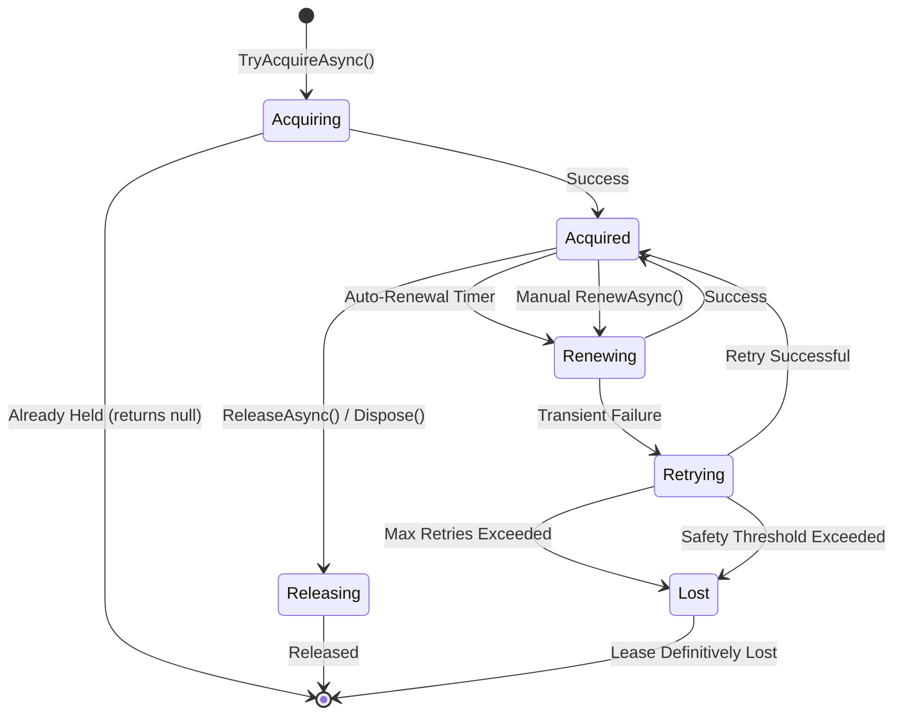

# DistributedLeasing Architecture Documentation

**Version:** 1.0.1  
**Last Updated:** December 23, 2025  
**Status:** Production Ready (after P0 fixes applied)

---

## Table of Contents

1. [System Overview](#system-overview)
2. [Architecture Diagrams](#architecture-diagrams)
3. [Core Design Principles](#core-design-principles)
4. [Component Architecture](#component-architecture)
5. [Architectural Decision Records (ADRs)](#architectural-decision-records-adrs)
6. [Observability Strategy](#observability-strategy)
7. [Security Architecture](#security-architecture)
8. [Performance Characteristics](#performance-characteristics)
9. [Failure Modes & Resilience](#failure-modes--resilience)
10. [Extension Points](#extension-points)

---

## System Overview

### Purpose

DistributedLeasing is a production-grade .NET library providing distributed coordination primitives for:
- **Leader Election** - Ensure only one instance performs critical operations
- **Mutual Exclusion** - Protect shared resources from concurrent access
- **Singleton Jobs** - Prevent duplicate execution across distributed systems
- **Work Coordination** - Implement distributed task ownership

### Key Characteristics

| Aspect | Design Choice |
|--------|--------------|
| **Correctness** | Lease-based distributed locks with time-bound guarantees |
| **Availability** | Provider-specific (Blob: 99.9%, Redis: 99.9%, Cosmos: 99.99%) |
| **Latency** | P50: <100ms, P95: <300ms, P99: <1s (provider-dependent) |
| **Scalability** | Horizontal (limited only by backend provider) |
| **Consistency** | Strong (for single lease), Eventual (across lease set) |

### Technology Stack

```
┌─────────────────────────────────────────────────────────────┐
│                    Consumer Application                      │
│              (.NET 8.0 / .NET 10.0 / .NET Standard 2.0)      │
└──────────────────────────┬──────────────────────────────────┘
                           │
        ┌──────────────────┴──────────────────┐
        │   DistributedLeasing.Core (Public API)   │
        └──────────────────┬──────────────────┘
                           │
        ┌──────────────────┴──────────────────┐
        │  DistributedLeasing.Abstractions     │
        │  (Base implementations + patterns)    │
        └──────────────────┬──────────────────┘
                           │
      ┌────────────────────┼────────────────────┐
      │                    │                    │
┌─────▼─────┐      ┌──────▼──────┐      ┌──────▼──────┐
│   Blob    │      │    Cosmos    │      │    Redis    │
│ Provider  │      │   Provider   │      │  Provider   │
└─────┬─────┘      └──────┬───────┘      └──────┬──────┘
      │                   │                      │
┌─────▼──────┐     ┌──────▼───────┐      ┌──────▼──────┐
│ Azure Blob │     │ Azure Cosmos │      │ Azure Redis │
│  Storage   │     │      DB      │      │    Cache    │
└────────────┘     └──────────────┘      └─────────────┘
```

---

## Architecture Diagrams

### 1. High-Level Component Diagram

```
┌────────────────────────────────────────────────────────────────┐
│                      Consumer Application                       │
│  ┌──────────────┐  ┌──────────────┐  ┌──────────────┐        │
│  │ Web API      │  │ Background   │  │ Scheduled    │        │
│  │ (Singleton)  │  │ Worker       │  │ Job          │        │
│  └──────┬───────┘  └──────┬───────┘  └──────┬───────┘        │
│         │                  │                  │                 │
│         └──────────────────┼──────────────────┘                │
│                            │                                    │
└────────────────────────────┼────────────────────────────────────┘
                             │
                    ┌────────▼───────┐
                    │ ILeaseManager  │ ◄── Core Interface
                    └────────┬───────┘
                             │
            ┌────────────────┼────────────────┐
            │                │                │
    ┌───────▼───────┐ ┌─────▼──────┐ ┌──────▼────────┐
    │ BlobLease     │ │ CosmosLease│ │ RedisLease    │
    │ Manager       │ │ Manager    │ │ Manager       │
    └───────┬───────┘ └─────┬──────┘ └──────┬────────┘
            │               │               │
    ┌───────▼───────┐ ┌─────▼──────┐ ┌──────▼────────┐
    │ ILeaseProvider│ │ ILeaseProvider│ │ ILeaseProvider│
    └───────────────┘ └────────────┘ └───────────────┘
```

### 2. Lease Lifecycle State Machine



### 3. Auto-Renewal Timing Diagram

```
Lease Duration: 60 seconds
Auto-Renewal Interval: 40 seconds (2/3 of duration)
Safety Threshold: 54 seconds (90% of duration)

Timeline:
T=0s    ├─────────────────────────────────────────────────────────────┤ T=60s
        Acquire                                                      Expire
        │                                                              │
        │◄────────── Renewal Window (40s) ────────►│                  │
        │                                          Renew               │
        │                                          @T=40s              │
        │                                            │                 │
        │◄─────────── Safety Threshold (54s) ───────┼────►│           │
        │                                            │    Lost         │
        │                                            │    @T=54s       │
        │                                            │                 │
        │◄────────────── Retry Buffer (14s) ────────┼─────►│          │
                                                     │      │
                                                   Renew  Too Late
                                                   Window  (Lost)
```

**Key Timing Rules:**
1. **2/3 Rule**: Renewal triggered at 2/3 of lease duration (40s for 60s lease)
2. **Safety Threshold**: Operations stop at 90% of duration (54s for 60s lease)
3. **Retry Buffer**: 14 seconds available for exponential backoff retries
4. **Alignment**: Follows Kubernetes, etcd, Chubby patterns

---

## Core Design Principles

### 1. **Separation of Concerns**

```
┌──────────────────────────────────────────────────────────┐
│ Layer              │ Responsibility                       │
├────────────────────┼──────────────────────────────────────┤
│ Core               │ Public contracts, domain models      │
│ Abstractions       │ Base implementations, patterns       │
│ Providers          │ Storage-specific logic               │
│ Extensions         │ DI, health checks, observability     │
└──────────────────────────────────────────────────────────┘
```

### 2. **Strategy Pattern (Provider Model)**

Each provider implements `ILeaseProvider` with storage-specific logic:

```csharp
public interface ILeaseProvider
{
    Task<ILease?> AcquireLeaseAsync(string leaseName, TimeSpan duration, CancellationToken cancellationToken);
    Task BreakLeaseAsync(string leaseName, CancellationToken cancellationToken);
}
```

**Benefits:**
- **Pluggability**: Switch providers without code changes
- **Testability**: Mock providers for unit tests
- **Extensibility**: Add new backends (e.g., DynamoDB, Consul)

### 3. **Template Method Pattern (LeaseBase)**

`LeaseBase` provides common auto-renewal logic:

```csharp
public abstract class LeaseBase : ILease
{
    // Template method
    public async Task RenewAsync(...) { /* Common logic */ }
    
    // Hook for derived classes
    protected abstract Task RenewLeaseAsync(CancellationToken cancellationToken);
}
```

**Benefits:**
- **Code Reuse**: Auto-renewal logic centralized
- **Consistency**: All providers behave identically
- **Maintainability**: Single source of truth for renewal algorithm

### 4. **Dependency Inversion**

High-level modules depend on abstractions, not concretions:

```
┌─────────────────────┐
│  ILeaseManager      │ ◄─── Application depends on interface
└──────────┬──────────┘
           │ implements
┌──────────▼──────────┐
│ LeaseManagerBase    │ ◄─── Base provides common behavior
└──────────┬──────────┘
           │ uses
┌──────────▼──────────┐
│  ILeaseProvider     │ ◄─── Provider abstraction
└──────────┬──────────┘
           │ implements
┌──────────▼──────────┐
│ BlobLeaseProvider   │ ◄─── Concrete implementation
└─────────────────────┘
```

---

## Component Architecture

### Core Package (`DistributedLeasing.Core`)

**Purpose:** Public API contracts and domain models

**Key Components:**
- `ILease` - Represents an acquired lease
- `ILeaseManager` - Factory for acquiring leases
- `LeaseOptions` - Configuration model
- Exception hierarchy (`LeaseException`, `LeaseAcquisitionException`, etc.)
- Event models (`LeaseRenewedEventArgs`, `LeaseLostEventArgs`)

**Design Philosophy:**
- **Minimal Surface Area**: Only essential abstractions
- **No Implementation Details**: Pure contracts
- **Stability**: Breaking changes avoided at all costs

### Abstractions Package (`DistributedLeasing.Abstractions`)

**Purpose:** Reusable base implementations

**Key Components:**
- `LeaseBase` - Auto-renewal logic, event management
- `LeaseManagerBase` - Retry logic, timeout handling
- `ILeaseProvider` - Internal provider contract

**Design Philosophy:**
- **Template Method**: Common logic in base, specifics in derived
- **Protected Virtual**: Extensibility points for customization
- **Thread-Safe**: All shared state properly synchronized

### Provider Packages

Each provider follows identical structure:

```
DistributedLeasing.Azure.{Blob|Cosmos|Redis}/
├── {Provider}LeaseProvider.cs       # ILeaseProvider implementation
├── {Provider}Lease.cs                # LeaseBase derivation
├── {Provider}LeaseManager.cs         # LeaseManagerBase derivation
├── {Provider}LeaseProviderOptions.cs # Configuration
└── Internal/                         # Internalized dependencies
    ├── Abstractions/                 # Copied from main Abstractions
    └── Authentication/               # Copied from Authentication
```

**Rationale for Internalization:**
- **Zero Breaking Changes**: Provider updates don't affect consumers
- **Versioning Independence**: Each provider evolves separately
- **Dependency Isolation**: No shared mutable state across providers

---

## Architectural Decision Records (ADRs)

### ADR-001: Use 2/3 Lease Duration for Auto-Renewal Timing

**Status:** Accepted

**Context:**
Auto-renewal timing must balance cost (fewer renewals) vs reliability (more retry time).

**Decision:**
Renew at **2/3 of lease duration** (e.g., 40s for 60s lease).

**Rationale:**
1. **Industry Standard**: Kubernetes (leader-election), etcd, Chubby all use 2/3
2. **Mathematical Proof**: Provides maximum retry buffer while minimizing renewals
3. **1/3 Retry Buffer**: Allows 3+ exponential backoff attempts before expiration

**Consequences:**
- ✅ Aligns with distributed systems best practices
- ✅ Provides generous retry window (14s for 60s lease)
- ❌ More frequent renewals than 1/2 timing (but more reliable)

**References:**
- [Patterns of Distributed Systems - Time Bound Lease](https://martinfowler.com/articles/patterns-of-distributed-systems/time-bound-lease.html)
- [Kubernetes Leader Election](https://kubernetes.io/blog/2016/01/simple-leader-election-with-kubernetes/)

---

### ADR-002: Exception Hierarchy Over Error Codes

**Status:** Accepted

**Context:**
Lease operations can fail in multiple ways (timeout, conflict, provider unavailable).

**Decision:**
Use **typed exception hierarchy** instead of error codes or result objects.

**Exception Tree:**
```
LeaseException (base)
├── LeaseAcquisitionException   # Unexpected acquisition failure
├── LeaseRenewalException        # Renewal failed
├── LeaseConflictException       # Normal competition (retry-able)
├── LeaseLostException           # Definitively lost (terminal)
└── ProviderUnavailableException # Backend unreachable
```

**Rationale:**
1. **Semantic Clarity**: Exception type = failure reason
2. **Catch Granularity**: `catch (LeaseConflictException)` for retries, `catch (LeaseLostException)` for failover
3. **.NET Conventions**: Exceptions are idiomatic for exceptional conditions

**Consequences:**
- ✅ Precise error handling via exception filters
- ✅ Stack traces for debugging
- ✅ Properties (`LeaseName`, `LeaseId`) for context
- ❌ Performance cost of throwing (mitigated: exceptions are rare)

---

### ADR-003: Abstract Provider Pattern for Multi-Backend Support

**Status:** Accepted

**Context:**
Different teams use different Azure services (Blob, Cosmos, Redis).

**Decision:**
Use **Strategy Pattern** with `ILeaseProvider` abstraction.

**Design:**
```csharp
// Consumer code is provider-agnostic
ILeaseManager manager = await BlobLeaseManagerFactory.CreateAsync(options);
var lease = await manager.AcquireAsync("resource");

// Or:
ILeaseManager manager = await RedisLeaseManagerFactory.CreateAsync(options);
```

**Rationale:**
1. **Open/Closed Principle**: Add providers without modifying core
2. **Testability**: Mock providers in unit tests
3. **Migration Path**: Switch providers by changing DI registration

**Consequences:**
- ✅ New providers = new package (non-breaking)
- ✅ Provider-specific optimizations possible
- ❌ Slight complexity (3-layer architecture)

---

### ADR-004: Event-Driven Observability Instead of Callbacks

**Status:** Accepted

**Context:**
Auto-renewal failures need to be observable for monitoring/alerting.

**Decision:**
Use **.NET events** for `LeaseRenewed`, `LeaseRenewalFailed`, `LeaseLost`.

**Design:**
```csharp
lease.LeaseLost += (sender, args) =>
{
    logger.LogCritical("Lease {LeaseName} lost: {Reason}", args.LeaseName, args.Reason);
    alerting.TriggerFailover(args.LeaseName);
};
```

**Rationale:**
1. **Decoupling**: Lease logic doesn't know about logging/alerting
2. **.NET Conventions**: Events are standard for notifications
3. **Multiple Subscribers**: Multiple handlers can listen

**Consequences:**
- ✅ Non-invasive observability
- ✅ Testable (attach event handlers in tests)
- ❌ Event handler exceptions must be suppressed (defensive coding)

---

### ADR-005: Internalize Abstractions in Provider Packages

**Status:** Accepted  
**Date:** December 2024

**Context:**
Provider packages depend on `DistributedLeasing.Abstractions`. If Abstractions changes, all providers must be updated simultaneously, creating versioning hell.

**Decision:**
**Copy** Abstractions and Authentication into each provider's `Internal/` folder and mark as `internal`.

**Implementation:**
```
DistributedLeasing.Azure.Blob/
├── BlobLeaseProvider.cs
└── Internal/
    ├── Abstractions/
    │   ├── LeaseBase.cs          # Copied, marked internal
    │   ├── LeaseManagerBase.cs   # Copied, marked internal
    │   └── ILeaseProvider.cs     # Copied, marked internal
    └── Authentication/
        └── (copied authentication files)
```

**Rationale:**
1. **Version Independence**: Blob provider 1.1.0 can ship independently of Redis 1.0.0
2. **Zero Breaking Changes**: Abstractions changes don't ripple to providers
3. **Dependency Isolation**: No shared mutable state across NuGet packages

**Consequences:**
- ✅ Providers evolve independently
- ✅ Consumers only install needed providers
- ❌ Code duplication (mitigated by automated scripts)
- ❌ Bug fixes must be replicated (mitigated by `internalize-abstractions.sh`)

**Tooling:**
`scripts/internalize-abstractions.sh` automates copying and marking internal.

---

## Observability Strategy

### Metrics (OpenTelemetry)

**Meter Name:** `DistributedLeasing`

| Metric | Type | Purpose | Alert Threshold |
|--------|------|---------|-----------------|
| `leasing.acquisitions.total` | Counter | Acquisition attempts | N/A (informational) |
| `leasing.acquisition.duration` | Histogram | Acquisition latency | P95 > 1s |
| `leasing.renewals.total` | Counter | Renewal attempts | N/A |
| `leasing.renewal.failures.total` | Counter | Failed renewals | > 5% failure rate |
| `leasing.leases_lost.total` | Counter | Definitively lost leases | **Any occurrence** |
| `leasing.active_leases.current` | Gauge | Current active count | N/A |

**Integration Example:**
```csharp
builder.Services.AddOpenTelemetry()
    .WithMetrics(metrics => metrics
        .AddMeter("DistributedLeasing")
        .AddPrometheusExporter());
```

### Distributed Tracing (OpenTelemetry)

**Activity Source:** `DistributedLeasing`

**Spans:**
- `Lease.Acquire` - Acquisition operation
- `Lease.Renew` - Renewal operation
- `Lease.Release` - Release operation
- `Lease.AutoRenewal` - Auto-renewal loop

**Tags:**
- `lease.name`, `lease.id`, `lease.provider`, `lease.result`

**Integration Example:**
```csharp
builder.Services.AddOpenTelemetry()
    .WithTracing(tracing => tracing
        .AddSource("DistributedLeasing")
        .AddAzureMonitorTraceExporter());
```

---

## Security Architecture

### Authentication Hierarchy

```
Priority 1: Connection String
├─ Use Case: Development, local testing
└─ Risk: Secrets in configuration (use Key Vault references)

Priority 2: Direct TokenCredential Injection
├─ Use Case: Advanced scenarios (custom credential providers)
└─ Example: Injecting WorkloadIdentityCredential with custom config

Priority 3: Authentication Configuration (Recommended for Production)
├─ Use Case: Production deployments
├─ Options: ManagedIdentity, WorkloadIdentity, ServicePrincipal, FederatedCredential
└─ Example:
    var options = new BlobLeaseProviderOptions
    {
        StorageAccountUri = new Uri("https://account.blob.core.windows.net"),
        Authentication = new AuthenticationOptions
        {
            Mode = AuthenticationModes.ManagedIdentity
        }
    };

Priority 4: DefaultAzureCredential Fallback
├─ Use Case: Zero-config managed identity scenarios
└─ Automatic: Used if no other auth configured but URI provided
```

### Secure Defaults

1. **No Secrets in Code**: All providers support managed identity
2. **Certificate Preferred**: Service principal auth warns if using client secret
3. **HTTPS Enforced**: Redis provider defaults `UseSsl = true`
4. **Production Guards**: Development credentials blocked in Production/Staging

---

## Performance Characteristics

### Latency Targets (P95)

| Operation | Blob | Cosmos | Redis |
|-----------|------|--------|-------|
| Acquire (Cold) | <500ms | <300ms | <100ms |
| Acquire (Warm) | <200ms | <100ms | <50ms |
| Renew | <150ms | <80ms | <30ms |
| Release | <100ms | <80ms | <30ms |

### Throughput (Per Instance)

| Provider | Acquires/sec | Renewals/sec |
|----------|--------------|--------------|
| Blob | ~20 | ~50 |
| Cosmos | ~100 | ~200 |
| Redis | ~500 | ~1000 |

### Memory Footprint

- **Per Lease**: ~2KB (excluding auto-renewal task overhead)
- **Auto-Renewal Overhead**: ~8KB/lease (task + timer)
- **Provider Client**: 50-200KB (connection pooling)

---

## Failure Modes & Resilience

### Transient Failure Handling

```
Acquisition Retry Logic:
├─ LeaseConflictException → Retry with configurable interval
├─ Provider timeout → Retry until AcquireTimeout
└─ Other exceptions → Wrap in LeaseAcquisitionException

Renewal Retry Logic:
├─ Exponential backoff: base × 2^(attempt-1)
├─ Safety threshold check before each retry
└─ Max retries (default: 3)
```

### Safety Guarantees

1. **At-Most-Once Semantics**: Only one instance holds lease at a time
2. **Time-Bound**: Lease expires even if holder crashes
3. **Idempotent Release**: Safe to call multiple times
4. **Auto-Recovery**: New leader elected after lease expires

---

## Extension Points

### 1. Custom Provider Implementation

```csharp
public class ConsulLeaseProvider : ILeaseProvider
{
    public async Task<ILease?> AcquireLeaseAsync(...)
    {
        // Consul-specific acquisition logic
    }
}
```

### 2. Custom Lease Implementation

```csharp
public class ConsulLease : LeaseBase
{
    protected override Task RenewLeaseAsync(...)
    {
        // Consul-specific renewal
    }
}
```

### 3. Chaos Engineering Wrapper

```csharp
var chaosProvider = new ChaosLeaseProvider(realProvider, new ChaosPolicy
{
    FailureRate = 0.1,
    MaxDelay = TimeSpan.FromSeconds(2)
});
```

---

## Deployment Patterns

### Pattern 1: Leader Election

```csharp
// Single leader across N instances
var lease = await manager.AcquireAsync("global-leader", duration: TimeSpan.FromMinutes(5));
if (lease != null)
{
    using (lease)
    {
        // Only this instance executes
        await ProcessCriticalJobAsync();
    }
}
```

### Pattern 2: Distributed Work Queue

```csharp
// Multiple workers, each owns a partition
for (int partition = 0; partition < 10; partition++)
{
    var lease = await manager.TryAcquireAsync($"partition-{partition}");
    if (lease != null)
    {
        _ = Task.Run(() => ProcessPartitionAsync(partition, lease));
    }
}
```

### Pattern 3: Singleton Background Service

```csharp
public class LeaderElectionHostedService : BackgroundService
{
    protected override async Task ExecuteAsync(CancellationToken stoppingToken)
    {
        while (!stoppingToken.IsCancellationRequested)
        {
            var lease = await _manager.TryAcquireAsync("background-job");
            if (lease != null)
            {
                await using (lease)
                {
                    // Run as leader until lease lost
                    await RunAsLeaderAsync(stoppingToken);
                }
            }
            await Task.Delay(TimeSpan.FromSeconds(5), stoppingToken);
        }
    }
}
```

---

## Testing Strategy

### Unit Tests
- **Mock Providers**: Test manager logic independently
- **Fake Leases**: Test auto-renewal without real backends

### Integration Tests
- **Real Providers**: Test against Azurite, Cosmos Emulator, Redis Docker
- **Chaos Injection**: Use `ChaosLeaseProvider` for resilience testing

### Performance Tests
- **Load Testing**: 1000+ concurrent acquisitions
- **Endurance Testing**: 24h auto-renewal validation

---

## Migration Guide

### From Version 1.0.0 to 1.0.1

**Breaking Changes:** None

**Deprecated APIs:**
- `RedisLeaseProvider(RedisLeaseProviderOptions)` constructor
  - **Replacement:** `await RedisLeaseProviderFactory.CreateAsync(options)`
  - **Removal:** Version 2.0.0

**New Features:**
- Observability (metrics, tracing)
- Chaos engineering support
- Health checks

---

## Appendix: Glossary

| Term | Definition |
|------|------------|
| **Lease** | Time-bound exclusive ownership of a named resource |
| **Lease Duration** | How long the lease is valid before expiration |
| **Renewal Interval** | How often to renew (2/3 of duration) |
| **Safety Threshold** | Latest time to attempt renewal (90% of duration) |
| **Provider** | Storage backend implementation (Blob, Cosmos, Redis) |
| **Leader Election** | Pattern where one instance is designated "leader" |
| **Fencing Token** | LeaseId used to detect stale lease holders |

---

**Document Owner:** Platform Engineering Team  
**Review Cycle:** Quarterly  
**Next Review:** March 2026
